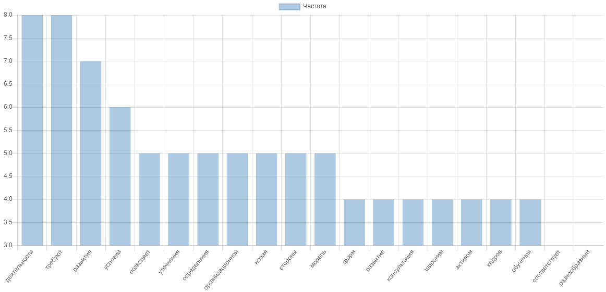

[](https://packagist.org/packages/gribanov/analyzer-text)
[](https://packagist.org/packages/gribanov/analyzer-text)
[](https://travis-ci.org/peter-gribanov/AnalyzerText)
[](https://coveralls.io/github/peter-gribanov/AnalyzerText?branch=master)
[](https://scrutinizer-ci.com/g/peter-gribanov/AnalyzerText/?branch=master)
[](https://styleci.io/repos/9087072)
[](https://github.com/peter-gribanov/AnalyzerText)

Анализатор текста
=================

Инструмент для анализа произвольного текста и получения из него максимум информации

Текс
----

Текс в приложени представляется в виде объектна-итератора и соответственно ячейкой итератора является объект слова.

```php
$text = '...'; // некоторый текст
$text_obj = new \AnalyzeText\Text($text);
// @var $word \AnalyzeText\Text\Word
$word = $text_obj->current();
```

Получив слово можно получить как его оригинальную форму так и форму в нижнем регистре для анализа.

*Текст на входе ожидается в кодировке UTF-8*

Анализаторы
-----------

Для анализа можно использовать предустановленные анализаторы передавая им объект текса.

* `Frequency` - подсчитывает частоту появления слова в тексте и процентное отнашение частоту появления к самому популярному слову.

Фильтры
-------

Набор фильтров для чистки текста содержащие более чем 3000 слов в библиотеке.

* `Adverb` - наречия
* `Interjection` - междометья
* `Particle` - частицы
* `Preposition` - предлоги
* `Pronoun` - местоимения
* `Union` - союзы
* `Informative` - информационные слова(фильтрует все описынные выше)

Использование
-------------

Пример реализации анализа естественности текста для SEO оптимизации.

```php
$frequency = new Frequency();
$frequency->setText(new Text($text));

// анализируем весь список слов
$graph = array_slice(array_merge_recursive($frequency->getFrequency(), $frequency->getPercent()), 0, 20);

// фильтруем и получаем только информационные слова
$frequency->applyFilters()->Informative();
$graph_filter = array_slice(array_merge_recursive($frequency->getFrequency(), $frequency->getPercent()), 0, 20);
```



Производительность

Для анализа производительности использовался следующий код

```php
$i = $ii = 1000;
$start = microtime(1);
while ($i--) {
    $frequency = new Frequency();
    $frequency->setText(new Text($text))->applyFilters()->Informative();
    $frequency->getFrequency();
    $frequency->getPercent();
}
echo (microtime(1) - $start) / $ii;
```

Для теста взят текст в 15190 символов, 2707 слов.

Результат: ~0.29 c.

Лицензия
--------

Этот пакет находится под [лицензией MIT](https://opensource.org/licenses/MIT). Смотрите полную лицензию в файле: LICENSE
